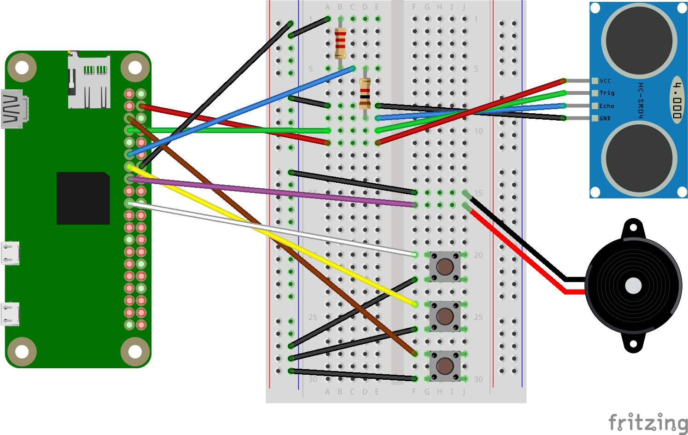
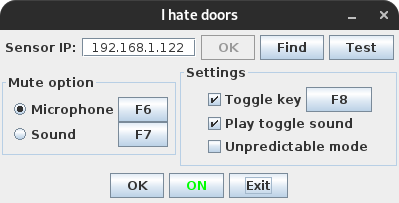

# I really hate doors (and people)
You know that feeling when you're on a Discord call, you don't want to be disturbed, but someone constantly feels the need to come and disturb you? This simple project can put you out of your misery.
## Installation
### Server
#### Installing and configuring MQTT server
```bash
sudo apt update
sudo apt upgrade
sudo systemctl enable mosquitto
```
In `/etc/mosquitto/mosquitto.conf` make the following changes:
```
listener 1883 0.0.0.0
allow_anonymous true
```
Then restart MQTT server:
```bash
sudo systemctl restart mosquitto
```
#### Installing server
```bash
cd your_download_folder   # optional
git clone https://github.com/jsfraz/i-hate-doors.git
cp -r i-hate-doors/i_hate_doors_server your_desired_folder   # optional
cd your_desired_folder/i_hate_doors_server
pip3 install -r requirements.txt    # installing python libraries
```
#### Running script as service
Create new file `/etc/systemd/system/ihatedoors.service` and paste the following (don't forget to modify the path):
```
[Unit]
Description=I hate doors
After=multi-user.target

[Service]
Type=simple
ExecStart=python3 your_desired_folder/i_hate_doors_server/main.py
Restart=on-abort

[Install]
WantedBy=multi-user.target
```
Then reload the daemon, enable and start the service:
```bash
sudo systemctl daemon-reload
sudo systemctl enable ihatedoors.service
sudo systemctl start ihatedoors.service
```
## How it works?
To detect room entry, you place a Raspberry Pi Zero with an ultrasonic sensor above the door. Whenever the door closes/opens, the Raspberry sends a message to the MQTT broker (itself). The desktop client then responds to this message by virtually pressing the mute/unmute key.
### Server
#### Schema


#### Buttons
- top button
  - used to initialize pairing with client (lasts 30 seconds)
  - client waits for server to send pairing packet
- middle button
  - on/off
- bottom button
  - shuts down Raspberry Pi
#### Beep codes
- one short
  - connected to MQTT broker
- two short
  - server stopped
- three short
  - disconnected from MQTT broker
- one long
  - pairing started
- two long
  - shutting down
- three long
  - failed to connect to MQTT broker

### Client


## TODO
- release client executable
- power from lithium battery
- create PCB and 3D print case
- MQTT security
## Disclaimer
This is intended for home use, communication with the MQTT server is not encrypted in any way.